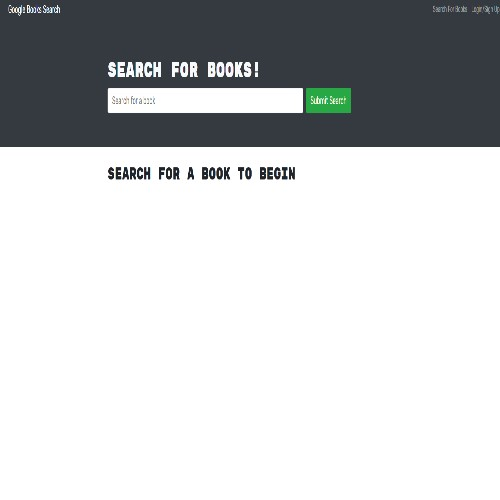

 
  
 # Solid Broccoli Google Book Search
 
  
  
  ## Table of Contents
[Description](#Description)     
  
[Languages and Technologies](#Languages-and-Technologies)
  
[Installation Instructions](#Installation-Instructions)
  
[Usage Instructions](#Usage-Instructions)
  
[License](#License)
  
[Contribution](#Contribution)
  
[Testing](#Testing)
  
[Acknowledgements](#Acknowledgements)
  
[Questions](#Questions)

  
  ## Description 
  ---
  A book search application that provides an image of the cover and a description/summary of the book.  
  
  ## Languages/Technologies
  ---
  HTML, CSS, JavaScript, React, Graphic QL, 
  
  ## Installation Instructions
  ---
  n/a
  
  ## Usage Instructions
  ---
  go to https://solid-broccoli.herokuapp.com/
  
  Navigate through the application to view previous projects and contact information.  
  
  ## License
  ---
  Licensed under the MIT license.
  
  ## Contribution
  ---
  
  ## Testing
  ---
  none
  
  ## Acknowledgements 
  ---
  Google book search API
  
  ## Questions
  ---
  [GitHub](https://github.com/durcoorigin) profile.

  E-mail: twitchshort@gmail.com
  
  ### Built by Chris Short 
